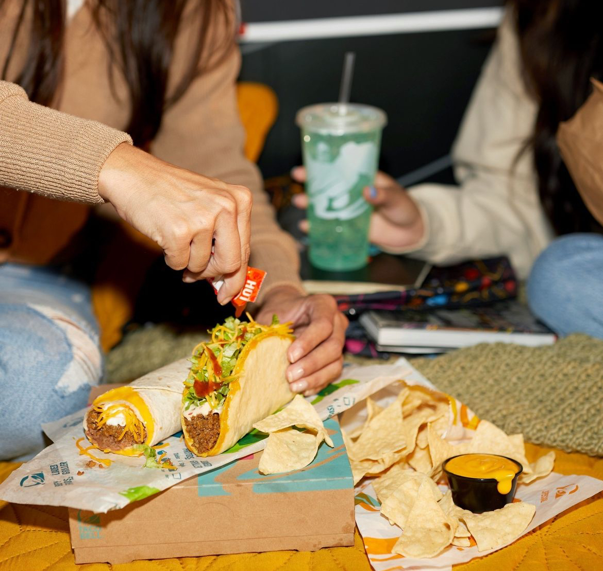

# staylor165.github.io
<!DOCTYPE html>
<html lang="en">
<head>
    <meta charset="UTF-8">
    <meta name="viewport" content="width=device-width, initial-scale=1.0">
    <title>Taco Bell Campaign</title>
    <link rel="preconnect" href="https://fonts.googleapis.com">
    <link rel="preconnect" href="https://fonts.gstatic.com" crossorigin>
    <link href="https://fonts.googleapis.com/css2?family=Atkinson+Hyperlegible:wght@400;700&display=swap" rel="stylesheet">

    
</head>
<body>

    

        <header>
            
            

                
                
                
            

        </header>

        

            <h1>Taco Bell Dollar Cravings Value Menu</h1>
            
ORDER YOUR FAVORITE TACO BELL CRAVINGS VALUE MENU ONLINE OR VISIT US AT THE TACO BELL LOCATION NEAREST YOU

            
Do you have a craving for Mexican inspired food and have a dollar in your pocket? If that’s the case, do we have a menu for you! At Taco Bell, you can find a variety of your favorite menu items for only one dollar. Find our take out specials near you today.

            
Got $3? Well, now you have an entire three-course meal! Start your meal off with an appetizer like the <a href="https://www.tacobell.com/food/sides/cheesy-roll-up" class="bold-names">Cheesy Roll Up</a> or <a href="https://www.tacobell.com/food/nachos/chips-and-nacho-cheese-sauce" class="bold-names">Chips and Nacho Cheese Sauce</a>. For the main dish, give the iconic <a href="https://www.tacobell.com/food/burritos/beefy-melt-burrito" class="bold-names">Beefy Melt Burrito</a> a try or enjoy the <a href="https://www.tacobell.com/food/cravings-value-menu/cheesy-bean-and-rice-burrito" class="bold-names">Cheesy Bean and Rice Burrito</a> instead. Top off your meal with a mouth-watering, dessert from the Taco Bell Cravings Value Menu such as <a href="https://www.tacobell.com/food/sweets/cinnamon-twists" class="bold-names">Cinnamon Twists</a>. Order fast food near you online from the Cravings Value Menu at Taco Bell today!

            

                
                
                
            

            <a href="https://www.tacobell.com/food/cravings-value-menu" class="cta-button" target="new">Explore Now</a>
        

    

</body>
</html>
